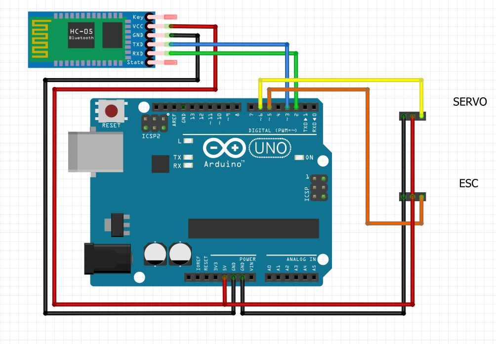
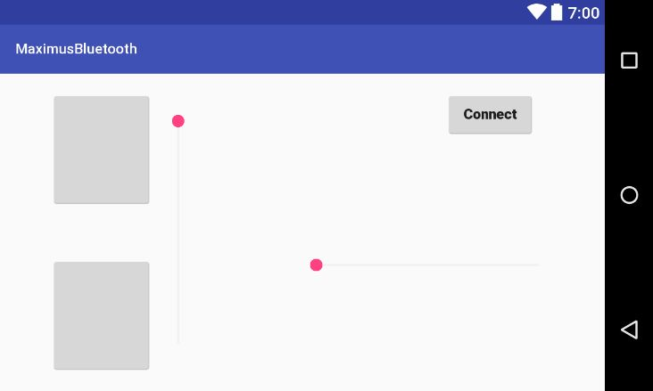

# Português 
# App Controle Bluetooth para RC
Um simples aplicativo para controlar um carrinho via Bluetooth 
Segue a foto com a pinagem da placa, para esse projeto pode-se usar qualquer placa Arduino e tanto os módulos HC-06 ou HC-05 bluetooth.
No momento a placa é alimentada pela ESC.

No momento o código tem alguns problemas, principalmente na troca de strings que vão do app para a placa. Causando alguns conflitos entre o motor e o servo, fazendo com que uma seekbar interfira na outra.
Mas funciona e serve como base para algo maior.
Para customizer basta procurar no arquivo do android as seekbars no mainactivity e editar, tambem fazendo se quiser no arquivo do Arduino.
Screenshot do aplicativo Android
